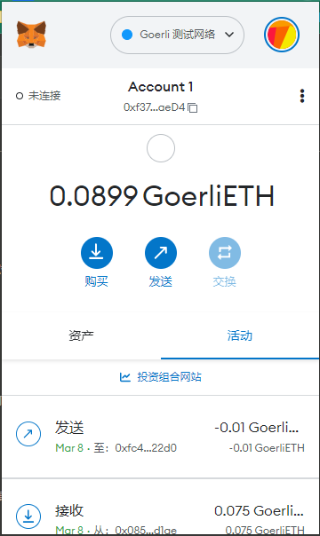

# w1-1

## 1. metamask账户

地址：0xf37816C765E30a9a0a5F807d3F6F38137CD3aeD4



## 2. 转账

From：0xf37816C765E30a9a0a5F807d3F6F38137CD3aeD4
To：0xFC4a0054158bDa4Ee99B03b1B2B1F702641722D0

etherscan:
https://goerli.etherscan.io/tx/0x035fa0e5152dd6e6c8345a61527c6bd087792214fa35171df1917e03abda93aa


## 3. 合约

### 代码
```javascript

// SPDX-License-Identifier: MIT
pragma solidity >=0.8.2 <0.9.0;

contract Counter{

    uint public count;

    function addCount(uint x) public {
        count += x;
    }

}

```

### 合约地址：
0x5F91108a891AC700064F9145fA8cf714035457b3

### 交易Hash：
0xa13e8b8812144d786466dc29b5fe98034a020960329d8837b52bc6100f971ba1

### etherscan：
https://goerli.etherscan.io/tx/0xa13e8b8812144d786466dc29b5fe98034a020960329d8837b52bc6100f971ba1


### 调用addCount

etherscan：
https://goerli.etherscan.io/tx/0x7f212e7127dc968bf643792057363190e9be7d96b8af2c9faef3569b7821cb4f


### 查询count
