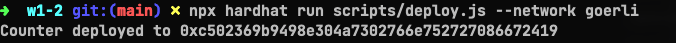
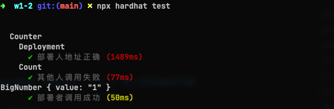
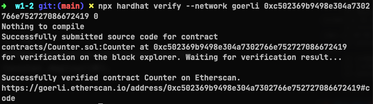

# w1-2作业
## 1. 修改 Counter 合约，仅有部署者 可以调用 count
```solidity
contract Counter{

  uint public counter;
  address public owner; // 定义合约拥有者

  constructor(uint x){
    counter = x;
    owner = msg.sender; // 部署时指定
  }

  function count() public {
    // 判断是否为owner
    require(msg.sender == owner,"only owner is allowed!");
    counter += 1;
  }

}
```

## 2. 使用 Hardhat 部署修改后的 Counter
```shell
npx hardhat run scripts/deploy.js --network goerli
Counter deployed to 0xc502369b9498e304a7302766e752727086672419
```


## 3. 使用 Hardhat 测试 Counter:
Case 1: 部署者成功调用 count
Case 2: 其他地址调用 count 失败

```solidity
  describe("Count", () => {
    it("其他人调用失败", async () => {
      const Counter = await ethers.getContractFactory("Counter");
      const counter = await Counter.deploy(10);
      await counter.deployed();

      const accounts = await ethers.getSigners();
      const attacker = accounts[1];

      await expect(counter.connect(attacker).count()).to.be.revertedWith(
        "only owner is allowed!"
      );

    });

    it("部署者调用成功",async () =>{
      const Counter = await ethers.getContractFactory("Counter");
      const counter = await Counter.deploy(0);
      await counter.deployed();

      [owner] = await ethers.getSigners();
      await counter.connect(owner).count();
      const count = await counter.counter();
      console.log(count);
      expect(count).to.be.equal(1);

      });

  });

```


## 4. 代码开源到区块浏览器(npx hardhat verify ...) / 写上合约地址代码
```shell
npx hardhat verify --network goerli 0xc502369b9498e304a7302766e752727086672419 0
```
etherscan:https://goerli.etherscan.io/address/0xc502369b9498e304a7302766e752727086672419#code

