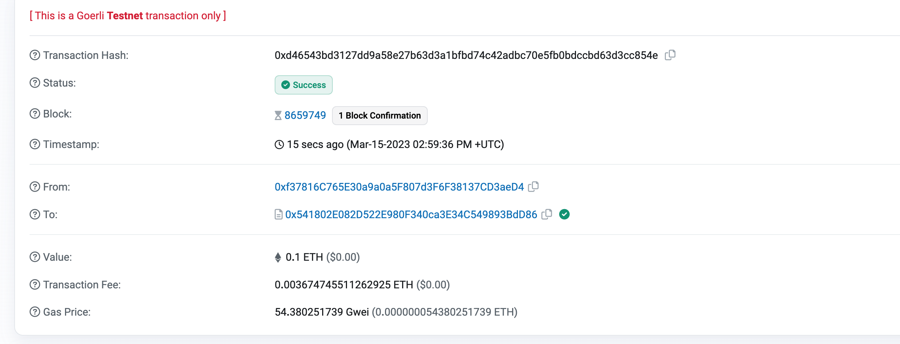
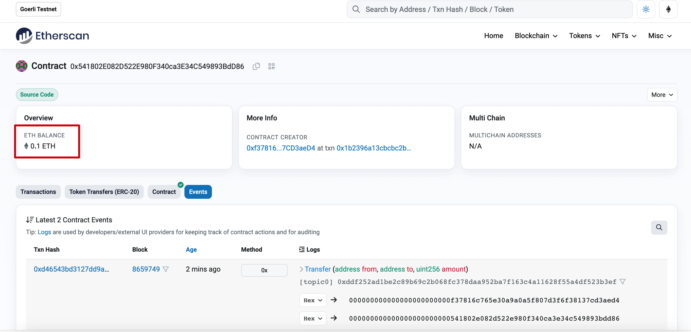
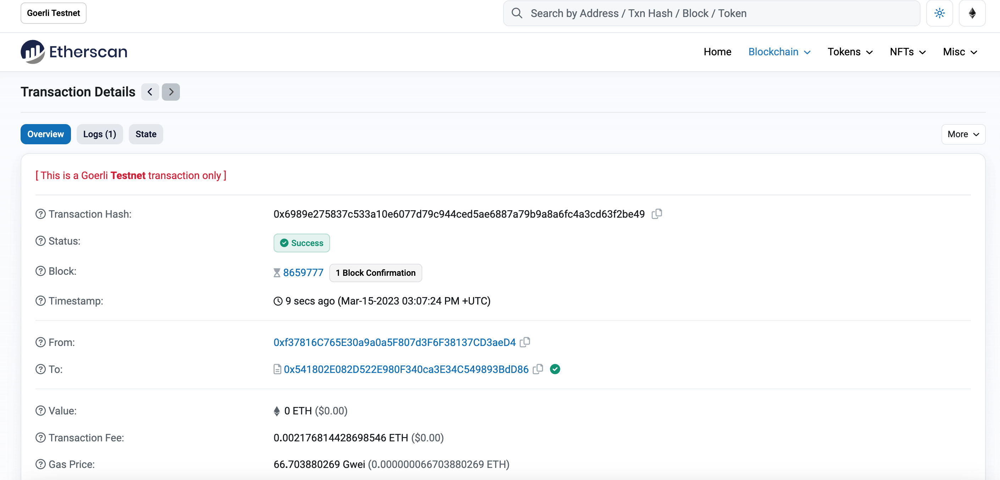
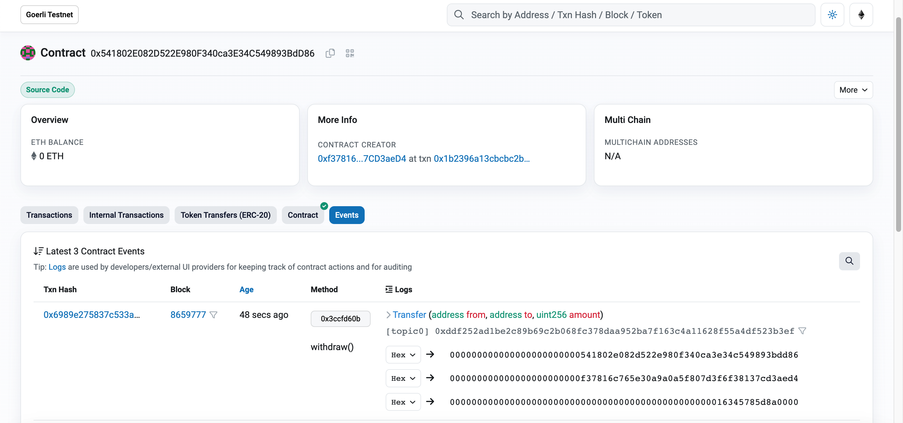

# w2-1 作业

## 编写一个Bank合约
### 通过 Metamask 向Bank合约转账ETH
合约内定义receive函数,用来接受ETH
```solidity
  receive() external payable {
          balances[msg.sender] = msg.value;
          totalAmount += msg.value;

          emit Transfer(msg.sender, address(this), msg.value);
      }
  }
```


交易Hash:0xd46543bd3127dd9a58e27b63d3a1bfbd74c42adbc70e5fb0bdccbd63d3cc854e



### 在Bank合约记录每个地址转账金额
```solidity
mapping(address => uint) public balances; // 银行账本
```

### 编写 Bank合约 withdraw0,实现提取出所有的ETH
```solidity
  // 提款函数
    function withdraw() external {
        // require(balances[msg.sender] >= 0, "account have no money.");
        if(balances[msg.sender] <= 0){
            revert("account has no money.");
        }
        uint amount = balances[msg.sender];
        balances[msg.sender] = 0;
        payable(msg.sender).transfer(amount);
        totalAmount -= amount;

        emit Transfer(address(this), msg.sender, amount);
    }
```

交易Hash:0x6989e275837c533a10e6077d79c944ced5ae6887a79b9a8a6fc4a3cd63f2be49
