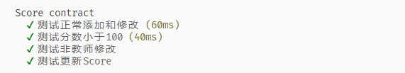
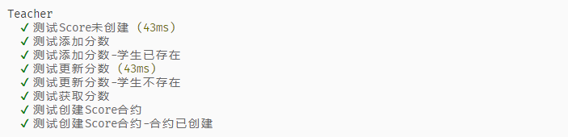
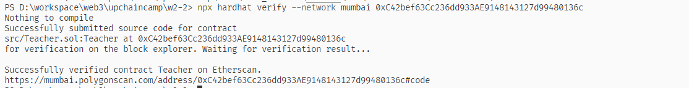

# w2-2 作业
## 编写合约Score,用于记录学生(地址)分数
> mumbai Score合约地址:0xc71EA3C160426c2Fad4607e1BC9aa0916aCC19be

## 单元测试


设计思路：
1. 利用一个mapping保存学生地址到分数的映射
```javascript
mapping(address => uint8) scores;
```

2. 记录一个teacher地址用来校验只能由该地址调用修改状态的方法
```javascript
address public teacher;

// 仅有teacher可以调用
modifier onlyTeacher() {
    if (msg.sender != teacher) {
        revert ScoreError("only teacher can modify");
    }
    _;
}
```

3. 检测分数小于100的修改器
```
modifier checkScore(uint8 _score) {
    if (_score > 100) {
        revert ScoreError("score must be less than 100");
    }
    _;
}
```

4. 定义接口供外部对接
```javascript

interface IScore {
    function addScore(address _student, uint8 _score) external;

    function updateScore(address _student, uint8 _score) external;

    function getScore(address _student) external view returns (uint8);
}
```
5. 新增方法实现
```
// 新增学生分数记录
function addScore(
    address _student,
    uint8 _score
) external override onlyTeacher checkScore(_score) {
    scores[_student] = _score;
    emit ScoreAddLog(_student, _score);
}

```
6. 修改方法实现
```
// 更新学生分数,检查地址合法性
function updateScore(
    address _student,
    uint8 _score
) external override onlyTeacher checkScore(_score) {
    uint8 _oldScore = scores[_student];
    scores[_student] = _score;

    emit ScoreUpdateLog(_student,_oldScore, _score);
}
```
## 编写合约Teacher作为老师,通过Iscore接口调用修改学生分数
mumbai Teacher合约地址:0xC42bef63Cc236dd933AE9148143127d99480136c
mumbai scan 链接：https://mumbai.polygonscan.com/address/0xC42bef63Cc236dd933AE9148143127d99480136c#code

## 单元测试


## 验证合约


设计思路：
1. 定义相关状态变量
```
IScore public score; // Score合约地址
address public owner; // 合约部署者
mapping(string => address) public students; // 记录学生名字=》学生地址的映射
mapping(address => bool) public studentRecords; // 记录学生地址是否添加过的映射,防重/跟新检测，节省不必要的gas

```

2. 定义权限修改器和检测score合约是否创建的修改器
```
modifier onlyOwner() {

    require(owner == msg.sender, "only owner can be used");
    _;

}

// 检测Score合约是否创建
modifier checkScoreExist() {

    require(address(score) != address(0), "Score contract is invalid");
    _;
    
}
```
3. 创建Score合约方法
```
function createScore() external onlyOwner {
    // 检测score合约必须为空地址，防止重复创建
    require(address(score) == address(0), "score already exists");
    score = new Score(address(this));

}
```
4. 添加分数方法
```
function addScore(
    string memory _name,
    address _student,
    uint8 _score
) external onlyOwner checkScoreExist{
    // 防重检测
    require(studentRecords[_student] == false, "student already exists");
    score.addScore(_student, _score);
    students[_name] = _student; // 添加name-> 地址关系
    studentRecords[_student] = true; // 添加地址-> 是否存在
    
}
```
5. 修改分数方法
```
function updateScore(address _student, uint8 _score) external onlyOwner checkScoreExist{
    // 检测学生是否存在
    require(studentRecords[_student] == true, "student not found");
    score.updateScore(_student, _score);

}
```

6. 获取分数方法，通过地址/姓名
```
function getScoreByAddress(address _student) external view checkScoreExist returns (uint8) {

    return score.getScore(_student);

}

function getScoreByName(string memory _student) external view checkScoreExist returns (uint8) {

    return score.getScore(students[_student]);

}

```