# w3-1 作业

## 发行一个 ERC20Token (用自己的名字)，发行100000 token
token地址：0xE13b88DFadB8ce969CBB088583A41a88d1F3c335

token名称：JinYu

token符号：JY

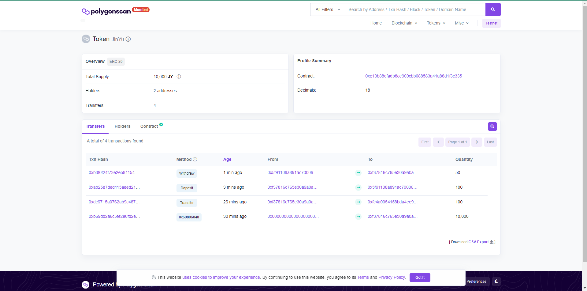

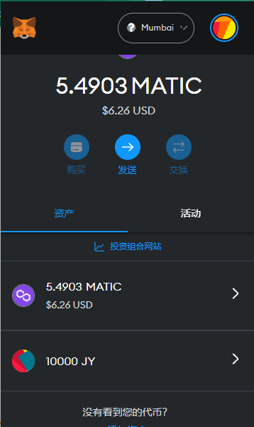

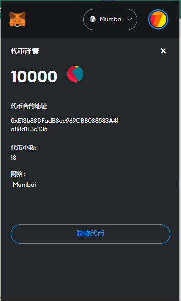

### 单元测试


### 验证
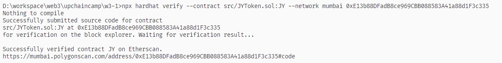


### 转账
交易Hash：0xdc6715a0762ab9c487094988f1629301a033ccd33fcb3cda5fcbd1968f2f5a6d
浏览器链接：https://mumbai.polygonscan.com/tx/0xdc6715a0762ab9c487094988f1629301a033ccd33fcb3cda5fcbd1968f2f5a6d
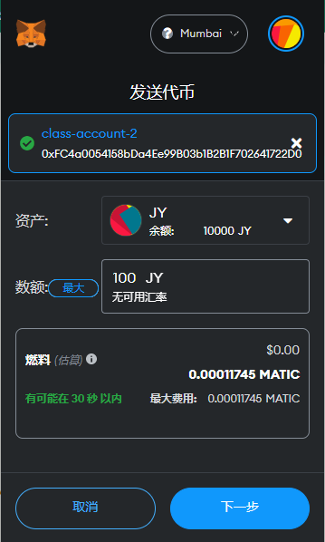

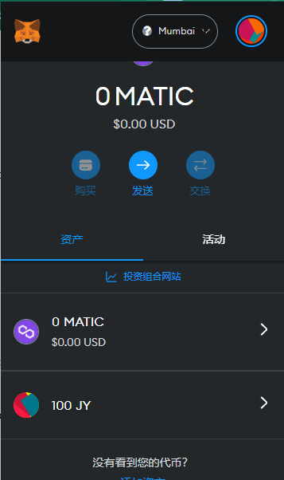


## 编写一个金库Vault 合约:

合约地址：0x5F91108a891AC700064F9145fA8cf714035457b3

浏览器链接：https://mumbai.polygonscan.com/address/0x5F91108a891AC700064F9145fA8cf714035457b3#code


### 验证

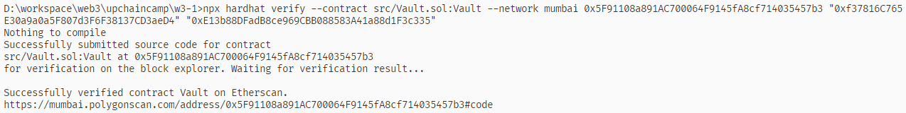

### 编写 deposite 方法，实现 ERC20 存入Vaut，并记录每个用户存款金额 (approve/transferFrom)

```
    function deposit(uint256 amount) external {
        require(token.balanceOf(msg.sender) >= amount, "Insufficient balance");
        token.transferFrom(msg.sender, address(this), amount);
        balances[msg.sender] += amount;
        emit Deposit(msg.sender, amount);
    }

```

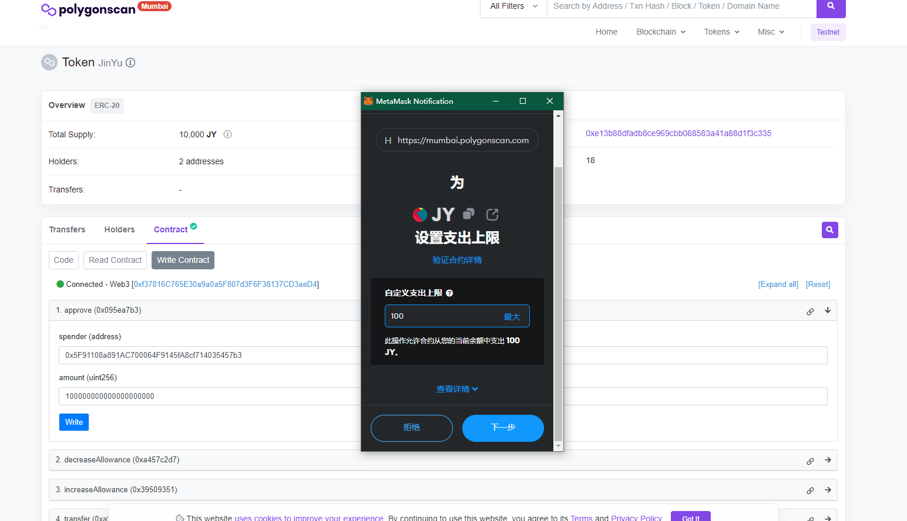

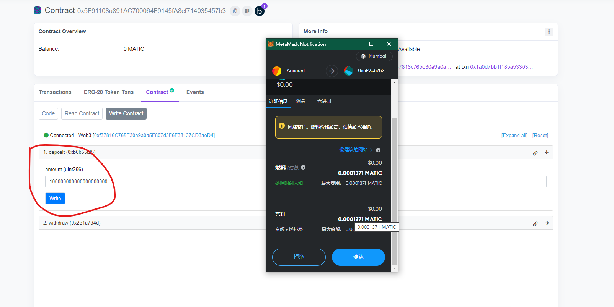

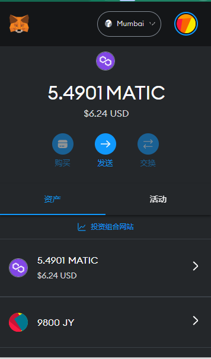


### 编写withdraw 方法，提取用户自己的存款

```
    function withdraw(uint256 amount) external {
        require(balances[msg.sender] >= amount, "Insufficient balance");
        token.transfer(msg.sender, amount);
        balances[msg.sender] -= amount;
        emit Withdrawal(msg.sender, amount);
    }
```
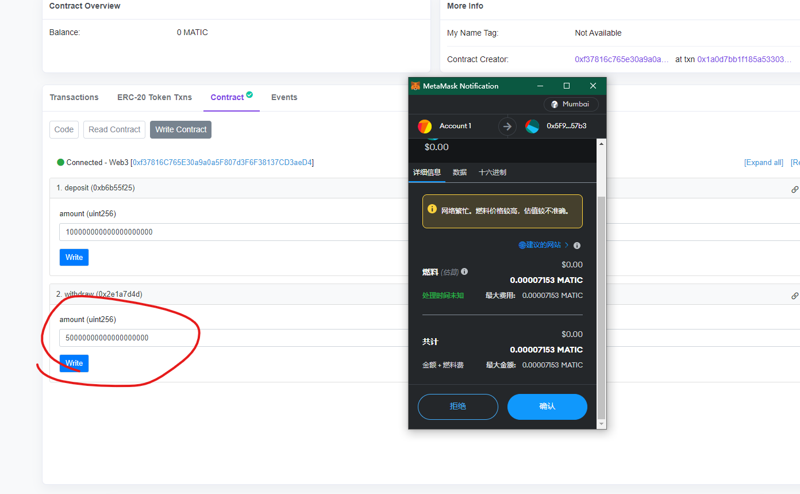

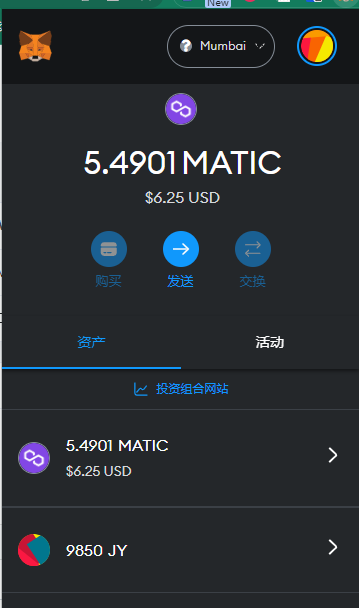

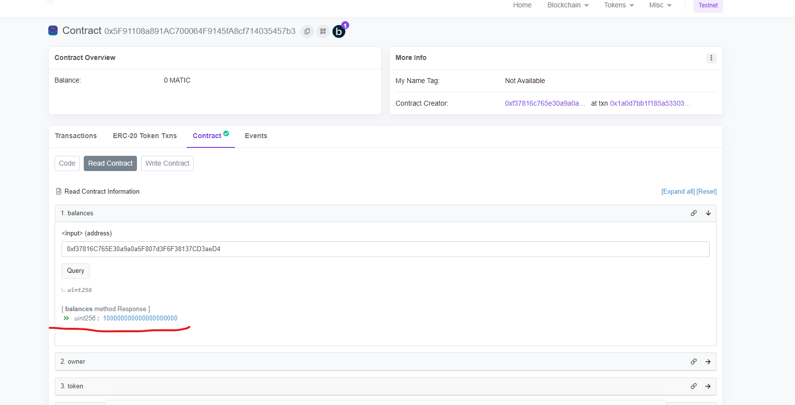

# NFT 
地址：0xb72056E262DD0E155aB76714d5165f63bF09bA68

## 上架Opensea：
https://testnets.opensea.io/zh-CN/collection/jynft-2


# NFT 交易市场

合约地址：0xA476744c23fA8Ba7E952BC1BcBF58428C6b73167

mumbai链接：https://mumbai.polygonscan.com/address/0xA476744c23fA8Ba7E952BC1BcBF58428C6b73167#code

## 实现思路：

### 定义订单结构体
```
    // 订单对象
    struct Order {
        address owner;
        uint256 tokenId;
        uint256 price;
    }
```
### 定义上架方法

1. 上架需要先授权nft给交易市场合约
2. 调用list方法，方法内部调用ERC721的safeTransferFrom方法，将NFT转给市场合约
3. 填充Order结构体，保存到orders内
   
```
// 上架
    function list(uint256 _tokenId, uint256 _price) public {
        // 检查所属权
        require(
            IERC721(_nftContract).ownerOf(_tokenId) == msg.sender,
            "not nft owner"
        );
        require(orders[_tokenId].owner == address(0), "nft already listing");

        IERC721(_nftContract).safeTransferFrom(
            msg.sender,
            address(this),
            _tokenId
        );
        orders[_tokenId] = Order(msg.sender, _tokenId, _price*10**18);

        emit Listed(msg.sender, _tokenId, _price);
    }


```


### 定义下架方法

从市场的orders中移除tokenId对应的订单

```
 // 下架
    function unlist(uint256 _tokenId) public {
        require(orders[_tokenId].owner == msg.sender, "only owner can unlist");

        IERC721(_nftContract).safeTransferFrom(
            address(this),
            msg.sender,
            _tokenId
        );
        delete orders[_tokenId];

        emit Unlisted(msg.sender, _tokenId);
    }


```

### 定义购买方法
1. 购买需要先给市场合约授权erc20 price个代币
2. 调用购买buy方法，先调用erc20的transferFrom，从购买者账户转账刀销售者账户
3. 调用ERC721的safeTransferFrom方法，将NFT转给购买者
```
    // 购买
    function buy(uint256 _tokenId) public payable {
        Order memory order = orders[_tokenId];
        require(order.owner != address(0), "order does not exist");
        // 检查token余额
        require(
            IERC20(_token).balanceOf(msg.sender) >= order.price,
            "balance not enough"
        );
        // 扣款，转账
        IERC20(_token).transferFrom(msg.sender, order.owner, order.price);
        IERC721(_nftContract).safeTransferFrom(
            address(this),
            msg.sender,
            _tokenId
        );

        // 删除order
        delete orders[_tokenId];

        emit Sold(order.owner, msg.sender, _tokenId, order.price);
    }

```