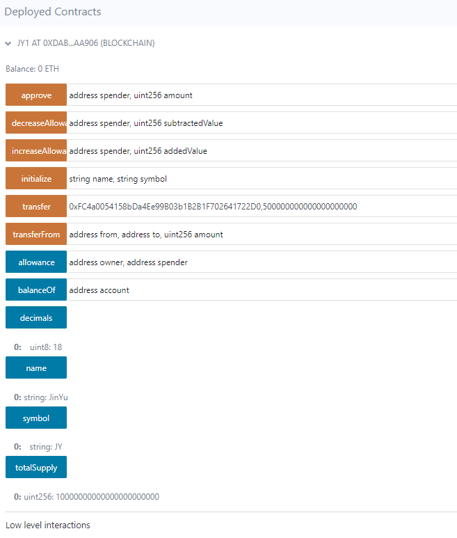
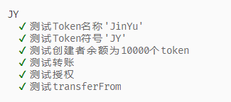
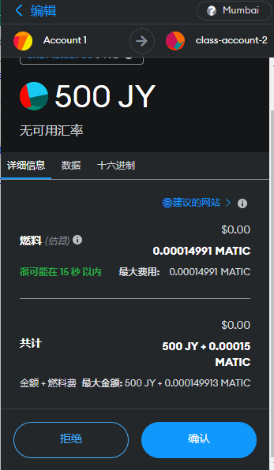
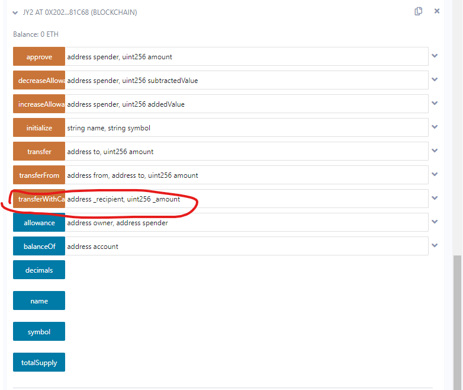
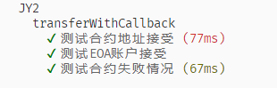
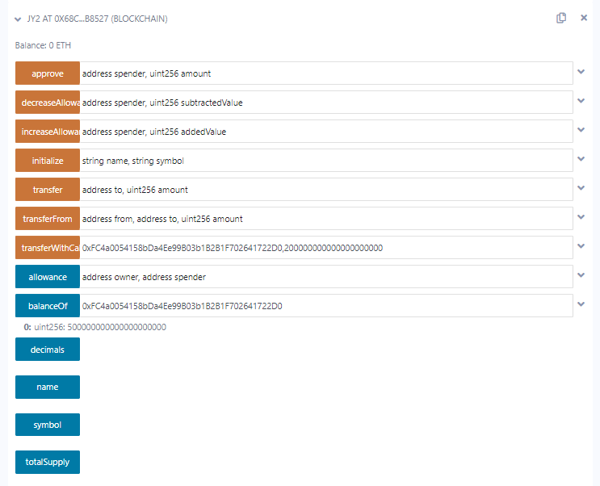
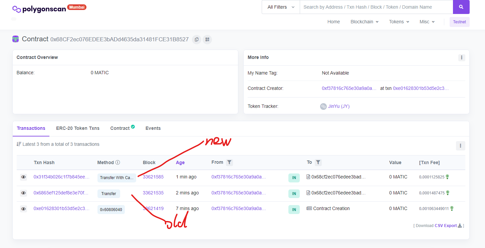

# w3-2作业

## 部署一个普通ERC20合约

代理合约地址：0x68CF2ec076EDEE3bADd4635da31481FCE31B8527

逻辑合约地址: 0x2028579234Fbea5922C079e91Cd34Aa52b281C68

mumbai浏览器地址：https://mumbai.polygonscan.com/address/0x68cf2ec076edee3badd4635da31481fce31b8527

合约的方法：

### 单元测试

### 转账

交易Hash：0x64f57993e4fbe56b5cb14ea82c8abd230b5aac4a415133fe934a0d03d592e435

mumbai浏览器地址：https://mumbai.polygonscan.com/tx/0x64f57993e4fbe56b5cb14ea82c8abd230b5aac4a415133fe934a0d03d592e435

## 升级带transferWithCallback的ERC20合约

代理合约地址：0x68CF2ec076EDEE3bADd4635da31481FCE31B8527

逻辑合约地址：0x2028579234Fbea5922C079e91Cd34Aa52b281C68

mumbai浏览器地址：https://mumbai.polygonscan.com/address/0x68cf2ec076edee3badd4635da31481fce31b8527

新合约方法：多了transferWithCallBack

### 单元测试

### 转账

### 转账记录

