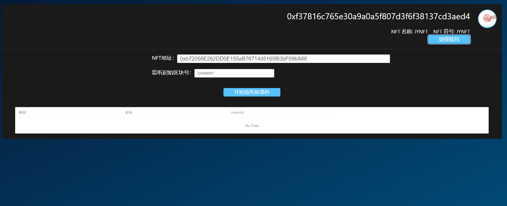

# w4-1 作业

## 作业1


### 合约信息

token地址: 0xdC681661337Dc7A1dF6405747Eb6879e35295Dec

金库合约地址: 0x69bb62c226d2143B816887c8991703cDDf45A632

前端代码: ./work1/web

实现步骤:

1. 导入合约ABI

abi路径: ./work1/web/deployments/abi/Vault.json

```
// 部分代码展示
	{
		"inputs": [
			{
				"internalType": "address",
				"name": "user",
				"type": "address"
			},
			{
				"internalType": "uint256",
				"name": "amount",
				"type": "uint256"
			}
		],
		"name": "deposit",
		"outputs": [],
		"stateMutability": "nonpayable",
		"type": "function"
	},
	{
		"inputs": [
			{
				"internalType": "uint256",
				"name": "amount",
				"type": "uint256"
			}
		],
		"name": "withdraw",
		"outputs": [],
		"stateMutability": "nonpayable",
		"type": "function"
	}
```
2. 编写Vault.vue组件
```
// 部分代码展示
// 授权
approve() {
  if(this.account == null ){
    this.$message.error("请先连接钱包");
    return false;
  }
  let amount = ethers.utils.parseUnits(this.approveAmount, 18);
  this.erc20Token.approve(this.approveRecipient, amount).then((r) => {
    console.log(r);  // 返回值不是true
    this.readContract();
  })
},
// 授权后的转账
    transferFrom() {
      if(this.account == null ){
        this.$message.error("请先连接钱包");
        return false;
      }
      let amount = ethers.utils.parseUnits(this.approveAmount, 18);
      console.log(`from:${this.account},to:${this.approveRecipient},amount:${amount}`)
      this.vault.deposit(this.account, amount).then((r) => {
        console.log(r);  // 返回值不是true
        this.readContract();
      })
    },
// 提款
async withdraw() {
  let amount = ethers.utils.parseUnits(this.withdrawAmount).toString();
  let tx = await this.vault.withdraw(amount);
  let result = await tx.wait();
  this.readContract();
},

```

### 效果演示

1. 初始页面:


2. 链接钱包:


3. 授权:
   
交易链接：
https://mumbai.polygonscan.com/tx/0x8c6970e7509f55caaa23d1b6469193fc3ce8ad92f0bd1e97b334b55a00b76fe3


1. 授权-转账:
   
交易链接：https://mumbai.polygonscan.com/tx/0x0bd043936a49ad2da24845c4c9264af0a83021114c350c8097eacc77659f9337


1. 离线签名转账:
   
交易链接：https://mumbai.polygonscan.com/tx/0xfff7b9c1d87e56e8e05cea4db5a19b0b8aa8c05dce3968514f5863d1491cb4bd


1. 提款:
   
交易链接：https://mumbai.polygonscan.com/tx/0xb6eeb89fc5a01dea732a41cb8c2ab58e0bf2c102f8a958b3fd362b5e4f55ff56


## 作业2

后端数据库暂未做
前端采用先查询历史再监听的方式获取数据


### NFT信息

NFT合约地址：0xb72056E262DD0E155aB76714d5165f63bF09bA68

### 实现步骤
1. 导入合约ABI
```
// 部分代码展示
[
  "constructor()",
  "function name() external view returns (string memory)",
  "function symbol() external view returns (string memory)",
  "function tokenURI(uint256 tokenId) external view returns (string memory)",
  "function balanceOf(address _owner) external view returns (uint256)",
  "function ownerOf(uint256 _tokenId) external view returns (address)",
  "function safeTransferFrom(address _from, address _to, uint256 _tokenId, bytes data) external payable",
  "function safeTransferFrom(address _from, address _to, uint256 _tokenId) external payable",
  "function transferFrom(address _from, address _to, uint256 _tokenId) external payable",
  "function approve(address _approved, uint256 _tokenId) external payable",
  "function setApprovalForAll(address _operator, bool _approved) external",
  "function getApproved(uint256 _tokenId) external view returns (address)",
  "function isApprovedForAll(address _owner, address _operator) external view returns (bool)",
  "event Transfer(address indexed _from, address indexed _to, uint256 indexed _tokenId)",
  "event Approval(address indexed _owner, address indexed _approved, uint256 indexed _tokenId)",
  "event ApprovalForAll(address indexed _owner, address indexed _operator, bool _approved)"
]

```

2. 编写JYNFT.vue组件
```
// 部分代码展示
// 监听事件
async queryTransferEvent() {
	if(this.readonlyNft == null){
		this.$message.error("请先绑定NFT");
		return false;
	}
	if(this.startBlockNumber == '' || this.startBlockNumber == null ){
		this.$message.error("请输入起始区块号");
		return false;
	}

	const block = await this.provider.getBlockNumber()

	// 首先查询历史事件33490097
	const historyEvent = await this.readonlyNft.queryFilter('Transfer',parseInt(this.startBlockNumber),block);
	historyEvent.forEach((item)=>{
		console.log(JSON.stringify(item.args))
		this.tableData.push({
			from: item.args[0],
			to: item.args[1],
			tokenId:ethers.BigNumber.from(item.args[2])
		})
	});

	// 监听新产生的事件
	const eventTransfer = this.readonlyNft.filters.Transfer(null, null, null);
	this.nft.on(eventTransfer, (from, to, tokenId) => {
		console.log(from, to, tokenId);
		this.tableData.push({
			from: from,
			to: to,
			tokenId: tokenId
		});
		this.$forceUpdate()
	})
	
	this.$message({
		message: '开始监听新事件',
		type: 'success'
	});
}


```

### 效果展示

1. 初始页面


2. 链接钱包- 链接NFT
   


3. 输入NFT地址（默认是我的JYNFT，可以通过切换钱包到其他网络，监听其他NFT事件），点击开始监听，首先会查询出历史事件，然后开启新的监听器监听新事件


