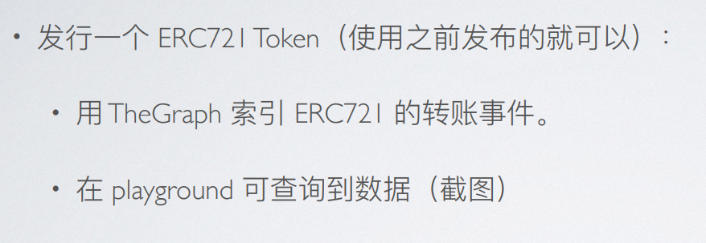
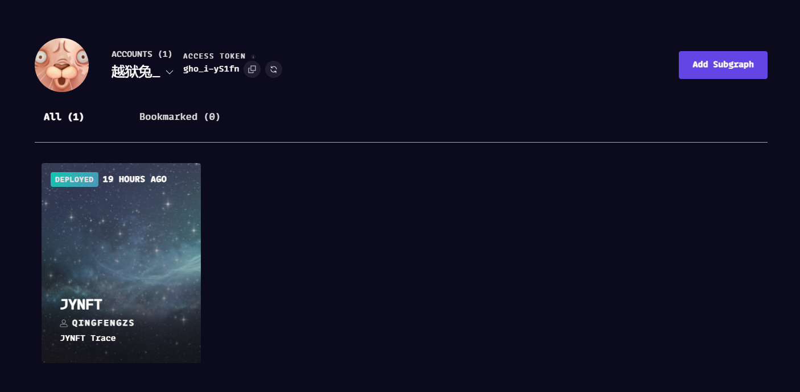
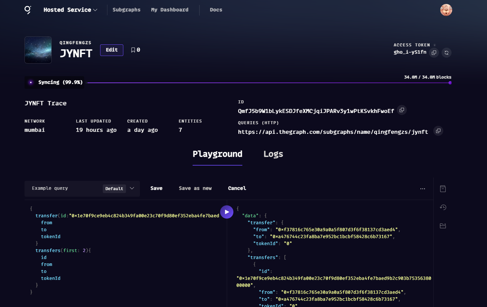
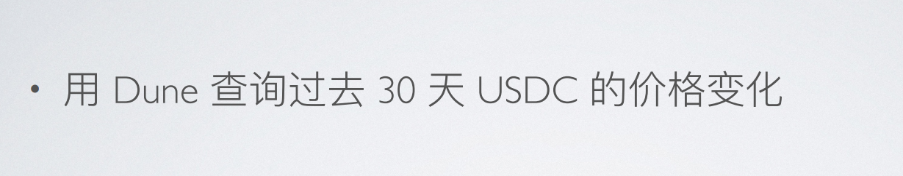
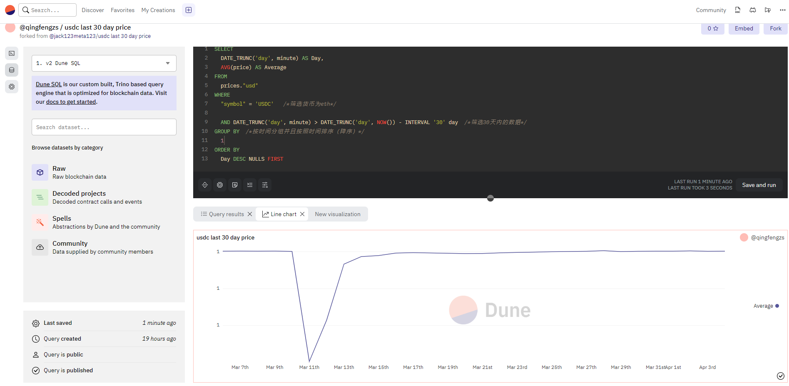

# w4-2 作业

## 作业1 



### 定义Transfer实体

```
type Transfer @entity(immutable: true) {
  id: Bytes!
  from: Bytes! # address
  to: Bytes! # address
  tokenId: BigInt! # uint256
  blockNumber: BigInt!
  blockTimestamp: BigInt!
  transactionHash: Bytes!
}

```


### 定义保存Transfer事件方法

```
export function handleTransfer(event: TransferEvent): void {
  let entity = new Transfer(
    event.transaction.hash.concatI32(event.logIndex.toI32())
  )
  entity.from = event.params.from
  entity.to = event.params.to
  entity.tokenId = event.params.tokenId

  entity.blockNumber = event.block.number
  entity.blockTimestamp = event.block.timestamp
  entity.transactionHash = event.transaction.hash

  entity.save()
}

```






## 作业2



### 定义查询语句

```
SELECT
  DATE_TRUNC('day', minute) AS Day,
  AVG(price) AS Average
FROM
  prices."usd"
WHERE
  "symbol" = 'USDC'
  AND DATE_TRUNC('day', minute) > DATE_TRUNC('day', NOW()) - INTERVAL '30' day
GROUP BY
  1
ORDER BY
  Day DESC NULLS FIRST

```




