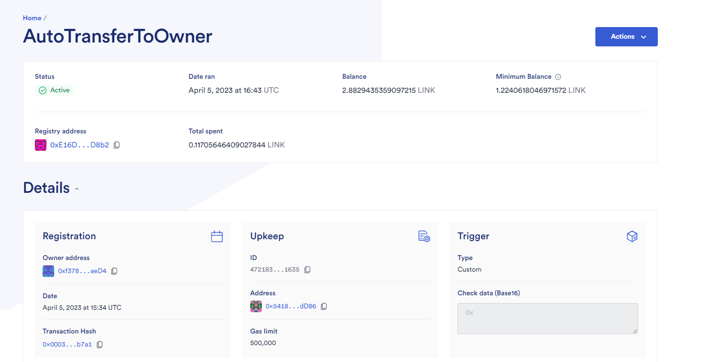
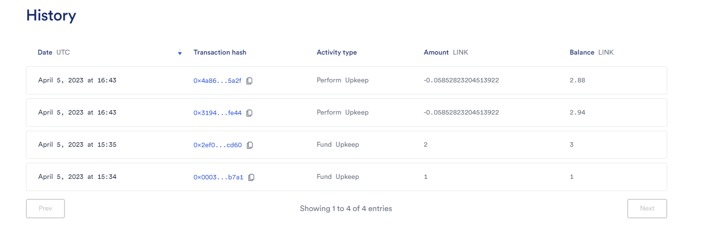
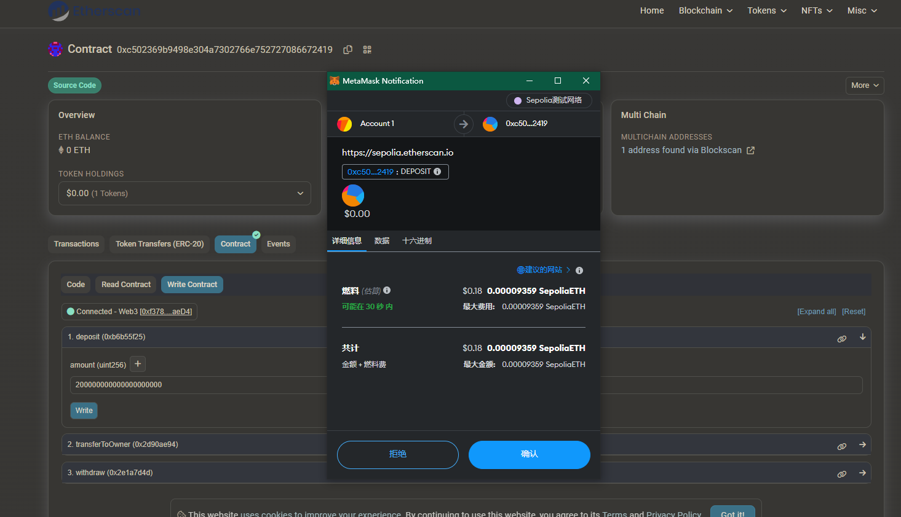
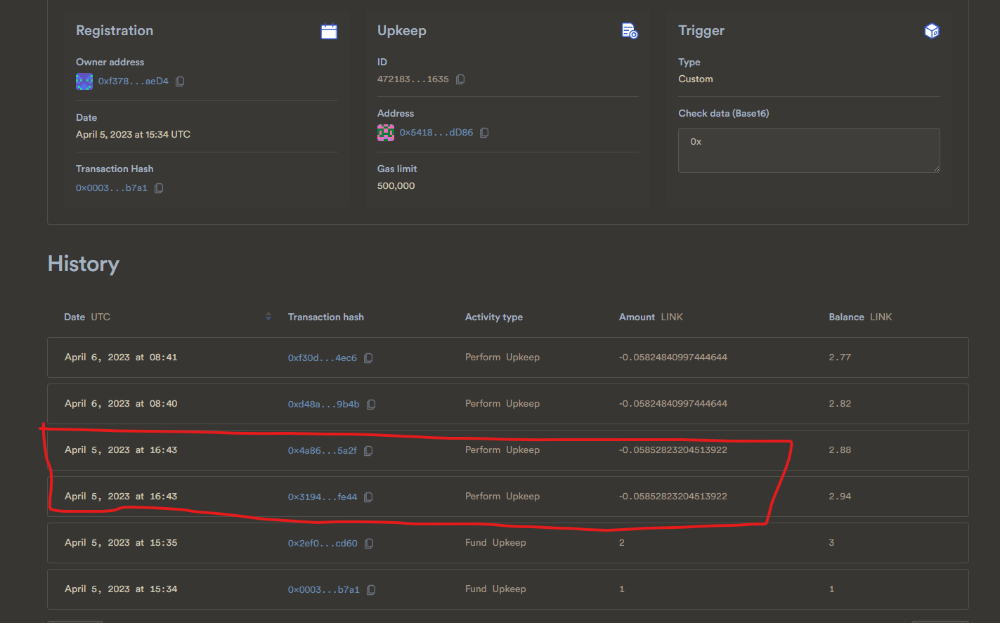

# w5-1 作业


Token地址：0x90D81B5387a350820C8955FC83b67D11F6aEb7Fb

Vault地址：0xc502369b9498e304a7302766e752727086672419

Upkeep地址：0x541802E082D522E980F340ca3E34C549893BdD86

## 实现步骤

1. 编写一个函数,实现存款超过100时自动转账到owner

```solidity
    function transferToOwner() external {
        require(totalAmount >= 100,"totalBalance is not enough");
        uint newTotalAmount = totalAmount/2;
        token.transfer(owner,newTotalAmount);
        totalAmount = newTotalAmount;
        emit TransferToOwner(owner,newTotalAmount);
    }
```

2. 编写upkeep合约
   
   ```solidity
   contract MyCheckUpKeep is AutomationCompatibleInterface {
       Vault public vault;
   
       constructor(address _vault) {
           vault = Vault(_vault);
       }
   
       function checkUpkeep(
           bytes calldata 
       )
           external
           view
           override
           returns (bool upkeepNeeded, bytes memory)
       {
           if(vault.totalAmount() >= 100 * 10 ** 18){
               upkeepNeeded = true;
           }
       }
   
       function performUpkeep(bytes calldata) external override {
           vault.transferToOwner();
       }
   }
   ```

3. 在ChainLink Automation配置

                             

## 演示操作

 1. 向Vault存入200Token（页面上输入要加18个0）    

     

交易链接：https://sepolia.etherscan.io/tx/0x3256b659ee4ba5706872cbb895d07b85b5a6a50adeaa5155a6270167ec7886f7


2. 查看Automation详情页面，可以看到多了两笔最新的交易
   
   
   
   交易链接
   
   1. https://sepolia.etherscan.io/tx/0x4a86f42cd6f4e5df6cd44a120e29713c28c96d43e92f2311ad5eca2c73aa5a2f
   
   2. https://sepolia.etherscan.io/tx/0x3194d4d71af7fabb6d0651270e8d3169e0b99d5d28639db161d6ed25453cfe44