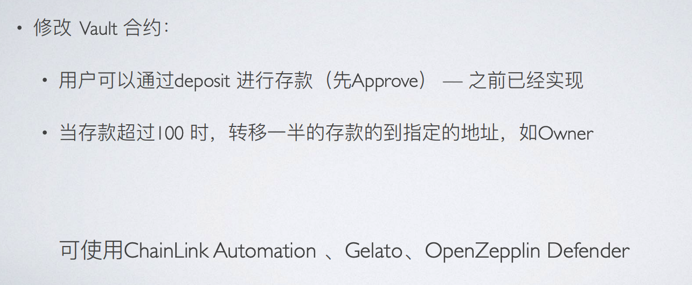

# w5-1 作业



## 实现步骤
1. 编写一个函数,实现存款超过100时自动转账到owner
Bank deployed to 0x90D81B5387a350820C8955FC83b67D11F6aEb7Fb
Bank deployed to 0xc502369b9498e304a7302766e752727086672419


0x541802E082D522E980F340ca3E34C549893BdD86
```


```