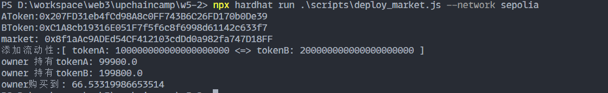

# w5-2 作业

## 练习题：


## 准备基础合约（uniswapv2、weth、token）

网络：sepolia

基础合约：

[v2-core-deployment](https://github.com/qingfengzs/v2-core-deployment)

[ v2-periphery-deployment](https://github.com/qingfengzs/v2-periphery-deployment)

| 合约名称 | 地址                                       |
| -------- | ------------------------------------------ |
| WETH     | 0xfE577425a7614a694911821e3FA505a0b223ba65 |
| Factory  | 0x2f90c27AF7acb8fF09Ef4ce6C409d59F1d342497 |
| Router   | 0xeFb379FdCb30aeaACB64712e2ba212859Ed23B78 |
| TokenA   | 0x207FD31eb4fCd98A8c0FF743B6C26FD170b0De39 |
| TokenB   | 0xC1A8cb19316E051F7f5f6c8f6998d61142c633f7 |
| Market   | 0x8f1aAc9ADEd54CF412103cdDd0a982fa747D18FF |

## 编写market合约

> 合约模板使用老师的代码，同时添加了token兑换token的方法

```solidity
    // 添加流动性:token-token
    function AddLiquidity(address tokenA,uint tokenAmountA,address tokenB,uint tokenAmountB) public payable {
        IERC20(tokenA).safeTransferFrom(msg.sender, address(this),tokenAmountA);
        IERC20(tokenA).safeApprove(router, tokenAmountA);

        IERC20(tokenB).safeTransferFrom(msg.sender, address(this),tokenAmountB);
        IERC20(tokenB).safeApprove(router, tokenAmountB);

        // ingnore slippage
        // (uint amountToken, uint amountETH, uint liquidity) = 
        IUniswapV2Router01(router).addLiquidity(tokenA,tokenB, tokenAmountA,tokenAmountB, 0, 0, msg.sender, block.timestamp);

    }  

    // 用 Token 购买 Token
    function buyTokenWithToken(address tokenA,address tokenB,uint amountIn,uint minTokenAmount) public {
        address[] memory path = new address[](2);
        path[0] = tokenA;
        path[1] = tokenB;
        // 转给market合约tokanA，用于兑换tokenB
        IERC20(tokenA).safeTransferFrom(msg.sender,address(this),amountIn);

        IERC20(tokenA).safeApprove(router, amountIn);

        IUniswapV2Router01(router).swapExactTokensForTokens(amountIn,minTokenAmount, path,msg.sender, block.timestamp);
  
    }

```

## 编写部署脚本

```solidity
    // await run('compile');
    let [owner] = await ethers.getSigners();

    let TokenA = await ethers.getContractFactory("Token");
    let tokena = await TokenA.deploy(
        "AToken",
        "AToken",
        ethers.utils.parseUnits("100000", 18));

    await tokena.deployed();
    console.log("AToken:" + tokena.address);

    let TokenB = await ethers.getContractFactory("Token");
    let tokenb = await TokenB.deploy(
        "BToken",
        "BToken",
        ethers.utils.parseUnits("200000", 18));

    await tokenb.deployed();
    console.log("BToken:" + tokenb.address);

    let MyTokenMarket = await ethers.getContractFactory("MyTokenMarket");

    // sepolia
    let routerAddr = "0xeFb379FdCb30aeaACB64712e2ba212859Ed23B78";
    let wethAddr = "0xfE577425a7614a694911821e3FA505a0b223ba65";
    // 本地
    // let routerAddr = "0xaaac9012592c0c4fdebf853bDF1a34232385D581";
    // let wethAddr = "0xC51c0619d25804d637Bb294b3bfaA0D0De6a8222";

    let market = await MyTokenMarket.deploy(
        routerAddr,
        wethAddr,
    );

    await market.deployed();
    console.log("market: " + market.address);

    await tokena.approve(market.address, ethers.utils.parseUnits("10000",18));
    await tokenb.approve(market.address, ethers.utils.parseUnits("20000",18));

    // 延时15s
    await wait(15000);

    let amountA = ethers.utils.parseUnits("100",18);
    let amountB = ethers.utils.parseUnits("200",18);
    console.log(`添加流动性:[ tokenA: ${amountA} <=> tokenB: ${amountB} ]`);
    await market.AddLiquidity(tokena.address,amountA,tokenb.address,amountB);
  
    // 延时15s
    await wait(15000);

    let inAmount = ethers.utils.parseUnits("50",18);
    let buyNumB = ethers.utils.parseUnits("10",18);

    let aAmount = await tokena.balanceOf(owner.address);
    let bAmount = await tokenb.balanceOf(owner.address);
    console.log("owner 持有tokenA: " + ethers.utils.formatUnits(aAmount, 18));
    console.log("owner 持有tokenB: " + ethers.utils.formatUnits(bAmount, 18));

    await market.buyTokenWithToken(tokena.address,tokenb.address,inAmount,buyNumB);

    // 延时15s
    await wait(15000);

    let buyAmount = await tokenb.balanceOf(owner.address);

    console.log("owner购买到: " + (ethers.utils.formatUnits(buyAmount, 18)-ethers.utils.formatUnits(bAmount, 18)));

```

## 部署到sepolia


