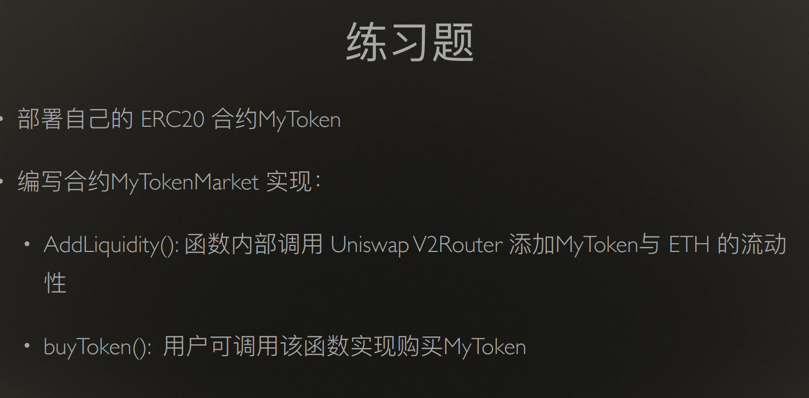

# w5-2 作业

## 练习题：

## 准备基础合约（uniswapv2、weth、token）：

网络：sepolia

UniswapV2Factory address:  0x2f90c27AF7acb8fF09Ef4ce6C409d59F1d342497
UniswapV2Pair code hash:  0x8897f1f34a81ee48d6fc425cd4779b617ea39c85f865509de3475880494a68b5
WETH address:  0xfE577425a7614a694911821e3FA505a0b223ba65
Router address:  0xeFb379FdCb30aeaACB64712e2ba212859Ed23B78

| 合约名称 | 地址 |
| ---|---|
|WETH|0x6EA5B3A980F5FBF4c969b089e9FE6182d89416B8|
|Factory|0x9727855869C4884394336A8c9Ac5171dAb435cCF|
|Router|0x9B6FEa644F41F24Ae676f5C99a253E4Ce148BB3b|
|TokenA|0x065F018D87B3a1EfB3F973fB3A4B262b76Da466d|
|TokenB|0xFa393cFDd36B0b6c8a4C8e623Bc289a1F3707B0D|
|Market|0x04a90894913656B843c5C6d83f96ed2D022898da|

## 编写market合约

