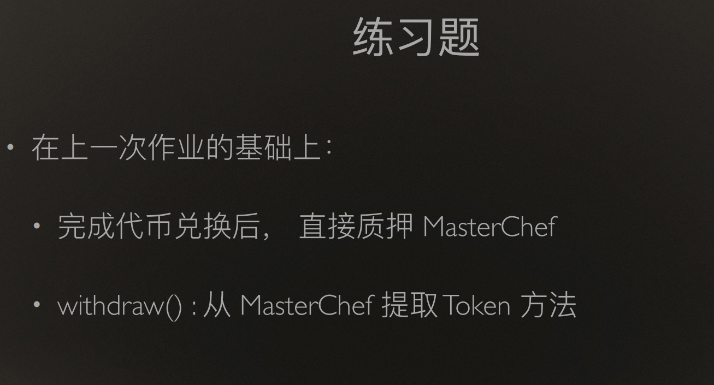

# w6-1

参考资料：sushi 源码分析：https://cloud.tencent.com/developer/article/1850628


## 练习题：



## 基础合约准备（uniswapv2、weth、token）

部署网络：sepolia

| 合约名称   | 地址                                       |
| ---------- | ------------------------------------------ |
| WETH       | 0xfE577425a7614a694911821e3FA505a0b223ba65 |
| Factory    | 0x2f90c27AF7acb8fF09Ef4ce6C409d59F1d342497 |
| Router     | 0xeFb379FdCb30aeaACB64712e2ba212859Ed23B78 |
| TokenA     | 0x207FD31eb4fCd98A8c0FF743B6C26FD170b0De39 |
| TokenB     | 0xC1A8cb19316E051F7f5f6c8f6998d61142c633f7 |
| SushiToken |                                            |
| Markek     |                                            |
| MasterChef |                                            |


## 合约工作原理

1. MasterChef合约中保存了矿池和参与挖矿用户的结构体信息，如果要进行挖矿，需要事先添加矿池，本作业中添加TokenA的矿池。
2. 在Market中购买一定量的token后，直接在buy函数中将兑换出的token转入MasterChef合约中进行挖矿，通过调用deposit实现。
3. 当一定时间后，调用MasterChef的withdraw提取用户获得的sushiToken和质押的TokenA。

## 实现步骤

1. 重新实现Market的buyToken函数
   ```javascript
   // 用 ETH 购买 Token
       function buyToken(uint minTokenAmount) public payable {
           address[] memory path = new address[](2);
           path[0] = weth;
           path[1] = myToken;

           IUniswapV2Router01(router).swapExactETHForTokens{value : msg.value}(minTokenAmount, path, address(this), block.timestamp);

           uint amount = IERC20(myToken).balanceOf(address(this));

           IERC20(myToken).safeApprove(masterchef, amount);

           IMasterChef(masterchef).deposit(0, amount);
           depsited += amount;

       }
   ```


2. 实现withdraw函数

   ```
   function withdraw() public {
           IMasterChef(masterchef).withdraw(0, depsited);
           IERC20(myToken).safeTransfer(msg.sender, depsited);

           uint amount = IERC20(sushi).balanceOf(address(this));
           IERC20(sushi).safeTransfer(msg.sender, amount);

       }

   ```

## 执行脚本

```
async function main() {
  // await run('compile');
  let [owner, second] = await ethers.getSigners();

  await deploySusui();
  await deployMasterChef();

  let tx = await susui.transferOwnership(masterChef.address);
  await tx.wait();

  let Token = await ethers.getContractFactory("Token");
  let aAmount = ethers.utils.parseUnits("100000", 18);
  let atoken = await Token.deploy("AToken", "AToken", aAmount);

  await atoken.deployed();
  console.log("AToken:" + atoken.address);

  tx = await masterChef.add(100, atoken.address, true);
  await tx.wait();

  let MyTokenMarket = await ethers.getContractFactory("MyTokenMarket");

  // sepolia
  // let routerAddr = "0xeFb379FdCb30aeaACB64712e2ba212859Ed23B78";
  // let wethAddr = "0xfE577425a7614a694911821e3FA505a0b223ba65";
  // local
  let routerAddr = "0xaaac9012592c0c4fdebf853bDF1a34232385D581";
  let wethAddr = "0xC51c0619d25804d637Bb294b3bfaA0D0De6a8222";

  let market = await MyTokenMarket.deploy(
    atoken.address,
    routerAddr,
    wethAddr,
    susui.address,
    masterChef.address
  );

  await market.deployed();
  console.log("market:" + market.address);

  await atoken.approve(market.address, ethers.constants.MaxUint256);

  let ethAmount = ethers.utils.parseUnits("5", 18);
  await market.AddLiquidity(aAmount, { value: ethAmount });
  console.log("添加流动性");

  let buyEthAmount = ethers.utils.parseUnits("10", 18);
  out = await market.buyToken("0", { value: buyEthAmount });

  b = await atoken.balanceOf(masterChef.address);
  console.log("存入:" + ethers.utils.formatUnits(b, 18));

  await delay.advanceBlock(ethers.provider);
  await delay.advanceBlock(ethers.provider);

  let pending = await masterChef.pendingSushi(0, market.address);
  console.log("收益:" + ethers.utils.formatUnits(pending, 18));

  tx = await market.withdraw();
  await tx.wait();

  b = await susui.balanceOf(owner.address);
  console.log("获取 sushi:" + ethers.utils.formatUnits(b, 18));
}
```
